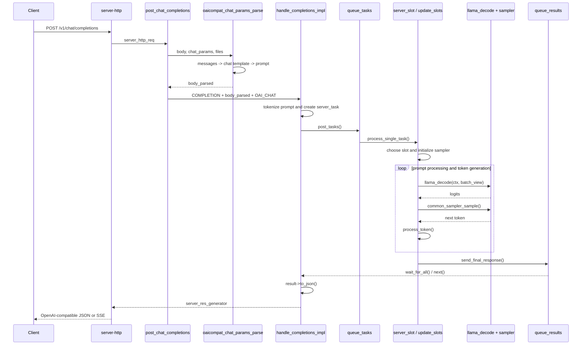

# llama.cpp `/v1/chat/completions` 完整流程追蹤

這份文件追蹤一般、非 router 模式下，一個 OpenAI-compatible
`POST /v1/chat/completions` 請求如何從 HTTP endpoint 進入 llama.cpp server，
轉成模型 prompt、排入推論 queue、執行 `llama_decode()`，最後回傳完整回覆。

文中也會補充 `stream: true` 的差異。

## 一句話總覽

```text
HTTP JSON messages
  -> OpenAI-compatible chat parser
  -> chat template prompt
  -> tokenization / multimodal processing
  -> server_task
  -> task queue
  -> inference slot
  -> batched llama_decode()
  -> sample next token
  -> repeat until stop
  -> result queue
  -> OpenAI-compatible JSON
  -> HTTP response
```

最容易混淆的地方是：

- `SERVER_TASK_TYPE_COMPLETION` 決定底層要執行「文字生成」。
- `TASK_RESPONSE_TYPE_OAI_CHAT` 決定生成結果要包裝成 OpenAI Chat Completions 格式。
- chat 對底層模型仍然是 completion。`messages` 必須先透過 chat template 轉成一段 prompt。

## 主要檔案

| 檔案 | 責任 |
|---|---|
| `tools/server/server.cpp` | 註冊 HTTP endpoints |
| `tools/server/server-http.cpp` | 將 HTTP request 包成 `server_http_req`，並送出 response |
| `tools/server/server-common.cpp` | 解析 OpenAI chat request、套用 chat template |
| `tools/server/server-context.cpp` | 建立 task、分配 slot、執行推論、產生結果 |
| `tools/server/server-queue.cpp` | task queue 與 result queue |
| `tools/server/server-task.cpp` | 解析生成參數、格式化最終與串流回覆 |

## Sequence Diagram



## 範例請求

```http
POST /v1/chat/completions
Content-Type: application/json

{
  "model": "local-model",
  "messages": [
    {
      "role": "user",
      "content": "請用一句話介紹 llama.cpp"
    }
  ],
  "temperature": 0.7,
  "max_tokens": 100,
  "stream": false
}
```

以下依照程式實際執行順序追蹤。

## 1. 註冊 HTTP Endpoint

`tools/server/server.cpp` 將兩個路徑註冊到同一個 handler：

```cpp
ctx_http.post("/chat/completions",    ex_wrapper(routes.post_chat_completions));
ctx_http.post("/v1/chat/completions", ex_wrapper(routes.post_chat_completions));
```

因此 `/chat/completions` 與 `/v1/chat/completions` 會走相同流程。

`server_http_context::post()` 位於 `tools/server/server-http.cpp`。它會：

1. 從 HTTP library 取得 path、headers、body 與連線狀態。
2. 建立 `server_http_req`。
3. 呼叫註冊的 route handler。
4. 將 handler 回傳的 `server_http_res` 寫回 HTTP client。

概念上相當於：

```cpp
server_http_req request = {
    .path = req.path,
    .body = req.body,
    .should_stop = req.is_connection_closed,
};

server_http_res_ptr response = handler(request);
process_handler_response(request, response, http_response);
```

`req.should_stop` 讓後續流程可以偵測 client 是否已斷線。

## 2. 進入 `post_chat_completions`

handler 定義在 `tools/server/server-context.cpp`：

```cpp
this->post_chat_completions = [this](const server_http_req & req) {
    auto res = create_response();
    std::vector<raw_buffer> files;
    json body = json::parse(req.body);

    json body_parsed = oaicompat_chat_params_parse(
        body,
        meta->chat_params,
        files);

    return handle_completions_impl(
        req,
        SERVER_TASK_TYPE_COMPLETION,
        body_parsed,
        files,
        TASK_RESPONSE_TYPE_OAI_CHAT);
};
```

這一層主要做兩件事：

1. 將 OpenAI chat request 轉成 llama.cpp 可執行的 completion 參數。
2. 呼叫共用的 completion handler。

## 3. 將 `messages` 轉成模型 Prompt

`oaicompat_chat_params_parse()` 位於 `tools/server/server-common.cpp`。

它不是只做 JSON 欄位重新命名，而是負責完整的 chat request 正規化：

1. 驗證 `messages`、`tools`、`tool_choice`、`response_format` 等欄位。
2. 解析 image/audio，將原始 bytes 放入 `files`。
3. 將 OpenAI messages 轉成 llama.cpp 的 `common_chat_msg`。
4. 套用目前模型的 chat template。
5. 建立 grammar、stop words、tool-call parser 等設定。
6. 保留 `temperature`、`max_tokens`、`stream` 等生成參數。

關鍵呼叫：

```cpp
inputs.messages = common_chat_msgs_parse_oaicompat(messages);
auto chat_params = common_chat_templates_apply(opt.tmpls.get(), inputs);

llama_params["prompt"] = chat_params.prompt;
```

原始 messages：

```json
{
  "messages": [
    {"role": "user", "content": "你好"}
  ]
}
```

可能依模型 template 轉成：

```text
<|user|>
你好
<|assistant|>
```

實際 special tokens 與格式由模型的 chat template 決定，不同模型不一定相同。

解析後的 `body_parsed` 概念上類似：

```json
{
  "prompt": "<|user|>\n你好\n<|assistant|>\n",
  "temperature": 0.7,
  "max_tokens": 100,
  "stream": false,
  "stop": ["<|end|>"],
  "chat_format": 1
}
```

## 4. `handle_completions_impl()` 的五個參數

呼叫：

```cpp
return handle_completions_impl(
    req,
    SERVER_TASK_TYPE_COMPLETION,
    body_parsed,
    files,
    TASK_RESPONSE_TYPE_OAI_CHAT);
```

| 參數 | 意義 |
|---|---|
| `req` | 目前 HTTP request，主要用於偵測連線是否中斷 |
| `SERVER_TASK_TYPE_COMPLETION` | 執行會產生 logits 並進行 sampling 的文字生成任務 |
| `body_parsed` | 已包含模型 prompt 與生成參數的 JSON |
| `files` | 圖片、音訊等 multimodal raw buffers |
| `TASK_RESPONSE_TYPE_OAI_CHAT` | 最終回覆使用 OpenAI Chat Completions 格式 |

`handle_completions_impl()` 回傳的是：

```cpp
std::unique_ptr<server_res_generator>
```

它不是生成文字本身，而是一個 HTTP response 物件。此物件同時持有
`server_response_reader`，用來從 result queue 讀取推論結果。

## 5. Prompt Tokenization 與建立 Task

`handle_completions_impl()` 首先取得解析後的 prompt：

```cpp
const auto & prompt = data.at("prompt");
```

純文字請求會進行 tokenization：

```cpp
inputs = tokenize_input_prompts(
    ctx_server.vocab,
    ctx_server.mctx,
    prompt,
    true,
    true);
```

multimodal OpenAI-compatible 請求則會將 prompt 與 `files` 一起處理：

```cpp
inputs.push_back(process_mtmd_prompt(
    ctx_server.mctx,
    prompt.get<std::string>(),
    files));
```

接著為每個 input 建立一個 `server_task`：

```cpp
server_task task(SERVER_TASK_TYPE_COMPLETION);

task.id     = rd.get_new_id();
task.tokens = std::move(inputs[i]);
task.params = server_task::params_from_json_cmpl(..., data);
```

`params_from_json_cmpl()` 會解析生成設定，例如：

- `stream`
- `max_tokens` / `max_completion_tokens` / `n_predict`
- `temperature`
- `top_k`
- `top_p`
- `frequency_penalty`
- `presence_penalty`
- `stop`
- `seed`
- `n`

然後記錄 response format 與 OpenAI-compatible metadata：

```cpp
task.params.res_type          = TASK_RESPONSE_TYPE_OAI_CHAT;
task.params.oaicompat_cmpl_id = completion_id;
task.params.oaicompat_model   = meta->model_name;
```

如果 request 設定 `n > 1`，還會建立 child tasks，讓同一份 prompt 產生多個回答。

## 6. Task 進入 Queue

task 建立完成後：

```cpp
rd.post_tasks(std::move(tasks));
```

`server_response_reader::post_tasks()` 位於 `tools/server/server-queue.cpp`，它會：

1. 記錄這個 HTTP response 正在等待哪些 task IDs。
2. 為串流 response 建立 generation state。
3. 將 tasks 放入 `queue_tasks`。

```text
HTTP request thread
  -> server_response_reader
  -> queue_tasks
  -> inference loop
```

這裡只是排入工作，不是在 HTTP thread 中直接執行整個模型推論。

## 7. Queue Loop 分配 Inference Slot

server 初始化時，會將 queue callbacks 接到：

```cpp
queue_tasks.on_new_task([this](server_task && task) {
    process_single_task(std::move(task));
});

queue_tasks.on_update_slots([this]() {
    update_slots();
});
```

`server_queue::start_loop()` 會反覆：

1. 從 `queue_tasks` 取出 task。
2. 呼叫 `process_single_task()`。
3. 呼叫 `update_slots()` 執行所有 active slots 的推論。

`process_single_task()` 會取得可用的 `server_slot`：

```cpp
server_slot * slot =
    id_slot != -1 ? get_slot_by_id(id_slot) : get_available_slot(task);
```

如果沒有可用 slot，task 會被 defer，稍後重試。

有可用 slot 時：

```cpp
launch_slot_with_task(*slot, std::move(task));
```

`launch_slot_with_task()` 會：

1. 驗證 tokens。
2. 處理每個 request 的 LoRA 設定。
3. 初始化 sampler chain。
4. 將 task 放進 slot。
5. 將 slot 狀態設成 `SLOT_STATE_STARTED`。

```cpp
slot.smpl.reset(common_sampler_init(model, task.params.sampling));
slot.task = std::make_unique<const server_task>(std::move(task));
slot.state = SLOT_STATE_STARTED;
```

## 8. `update_slots()` 建立 Batch

`update_slots()` 是 server 推論主迴圈。

它會將多個 active slots 的 tokens 組進同一個 `common_batch`。因此多個 HTTP
requests 可以在同一次模型 decode 中進行 continuous batching。

對新 request，slot 狀態會從：

```text
SLOT_STATE_STARTED
  -> SLOT_STATE_PROCESSING_PROMPT
  -> SLOT_STATE_DONE_PROMPT
  -> SLOT_STATE_GENERATING
```

處理 prompt 時，server 也會嘗試重用相同 prefix 的 KV cache：

```cpp
n_past = slot.prompt.tokens.get_common_prefix(input_tokens);
```

尚未快取的 prompt tokens 會加入 batch：

```cpp
common_batch_add(
    batch,
    cur_tok,
    slot.prompt.tokens.pos_next(),
    { slot.id },
    slot.task->need_embd());
```

prompt 最後一個 token 會要求輸出 logits：

```cpp
batch.logits[batch.n_tokens - 1] = true;
slot.i_batch = batch.n_tokens - 1;
```

這些 logits 用來選出回答的第一個 token。

## 9. 真正執行模型：`llama_decode()`

batch 建立完成後，真正進入模型計算的地方是：

```cpp
const int ret = llama_decode(ctx, batch_view);
```

`llama_decode()` 會對 batch 中的 tokens 執行模型 forward pass，更新該 sequence
的 model memory / KV cache，並為指定位置產生 logits。

第一次主要處理 prompt：

```text
prompt tokens
  -> llama_decode()
  -> 更新 KV cache
  -> 最後一個 prompt token 的 logits
```

後續每次主要處理上一輪產生的 token：

```text
previous generated token
  -> llama_decode()
  -> 更新 KV cache
  -> 下一個 token 的 logits
```

`llama_decode()` 本身不會直接產生完整文字回答。它負責執行模型並提供 logits；
server 還需要 sampler 從 logits 中選出下一個 token。

## 10. Sampling 下一個 Token

prompt decode 完成後：

```cpp
slot.state = SLOT_STATE_GENERATING;
```

server 使用 sampler 選下一個 token：

```cpp
llama_token id = common_sampler_sample(slot.smpl.get(), slot.ctx, tok_idx);
common_sampler_accept(slot.smpl.get(), id, true);
```

sampling 過程會套用 request 中的設定，例如 temperature、top-p、top-k、
penalties、grammar 與 logit bias。

token 接著被轉回文字片段：

```cpp
result.tok = id;
result.text_to_send = common_token_to_piece(slot.ctx, result.tok, ...);
```

然後交給：

```cpp
process_token(result, slot);
```

## 11. `process_token()` 與停止條件

`process_token()` 會：

1. 將 token 文字附加到 `slot.generated_text`。
2. 處理不完整 UTF-8 字元。
3. 偵測並移除 stop word。
4. 在串流模式送出 partial response。
5. 檢查生成是否應停止。

主要停止條件：

- 模型產生 EOG/EOS token。
- 命中 request 的 stop word。
- 達到 `max_tokens` / `n_predict`。
- context 已滿。
- 達到時間或其他限制。

例如 EOS：

```cpp
if (llama_vocab_is_eog(vocab, result.tok)) {
    slot.stop = STOP_TYPE_EOS;
    slot.has_next_token = false;
}
```

如果尚未停止，生成出的 token 會在下一輪 `update_slots()` 被放入 batch，
再次呼叫 `llama_decode()`，以取得再下一個 token 的 logits。

```text
llama_decode
  -> sample token
  -> process token
  -> add token to next batch
  -> llama_decode
  -> sample token
  -> ...
```

## 12. 建立 Final Result

停止條件成立時：

```cpp
send_final_response(slot);
slot.release();
```

`send_final_response()` 建立：

```cpp
server_task_result_cmpl_final
```

非串流模式下，完整生成文字會放進：

```cpp
res->content = std::move(slot.generated_text);
```

結果也會帶上：

- prompt token 數量
- generated token 數量
- stop reason
- timings
- model name
- OpenAI completion ID
- response type

最後送入 result queue：

```cpp
queue_results.send(std::move(res));
```

## 13. 非串流：組成完整 OpenAI 回覆

當 request 使用：

```json
{"stream": false}
```

`handle_completions_impl()` 會等待所有 tasks 完成：

```cpp
auto all_results = rd.wait_for_all(req.should_stop);
```

`wait_for_all()` 內部透過 `server_response_reader::next()` 從 result queue 取回結果。
取回後，它會先更新該 task 的 response parsing state：

```cpp
result->update(states[idx]);
```

對 OpenAI chat final result，這一步會呼叫：

```cpp
oaicompat_msg = state.update_chat_msg(
    content,
    false,
    oaicompat_msg_diffs);
```

`task_result_state::update_chat_msg()` 使用 `common_chat_parse()`，依照前面建立的
chat parser 設定，將模型原始輸出解析成結構化 assistant message。除了普通
`content`，也可能解析出 reasoning content 與 tool calls。

因此模型生成的原始字串，不一定會直接原封不動放進 OpenAI `message.content`。
它會先經過模型格式對應的 chat parser。

每個 final result 會呼叫：

```cpp
result->to_json();
```

因為 `res_type` 是 `TASK_RESPONSE_TYPE_OAI_CHAT`，因此會走：

```cpp
server_task_result_cmpl_final::to_json_oaicompat_chat()
```

它會將生成文字放進：

```json
{
  "choices": [
    {
      "finish_reason": "stop",
      "index": 0,
      "message": {
        "role": "assistant",
        "content": "llama.cpp 是一個可在本機高效率執行大型語言模型的 C/C++ 推論專案。"
      }
    }
  ],
  "object": "chat.completion",
  "model": "local-model",
  "id": "chatcmpl-...",
  "usage": {
    "prompt_tokens": 20,
    "completion_tokens": 25,
    "total_tokens": 45
  }
}
```

接著：

```cpp
res->ok(arr[0]);
```

`server_res_generator::ok()` 將 JSON serialize 到 HTTP response：

```cpp
status = 200;
data = safe_json_to_str(response_data);
```

最後 `server-http.cpp` 使用：

```cpp
res.set_content(response->data, response->content_type);
```

將完整 JSON 回傳給 client。

## 14. 串流：每個 Token 逐段回傳

當 request 使用：

```json
{"stream": true}
```

`process_token()` 會在生成期間呼叫：

```cpp
send_partial_response(slot, result, false);
```

partial result 經過：

```cpp
server_task_result_cmpl_partial::to_json_oaicompat_chat()
```

轉成 OpenAI chat delta。`handle_completions_impl()` 再使用：

```cpp
format_oai_sse(result_json)
```

包成 SSE：

```text
data: {"choices":[{"delta":{"role":"assistant","content":null}}],...}

data: {"choices":[{"delta":{"content":"llama"}}],...}

data: {"choices":[{"delta":{"content":".cpp"}}],...}

data: [DONE]
```

串流 response 的 `content_type` 是：

```text
text/event-stream
```

HTTP 層透過 `response->next` 與 chunked content provider 持續取得下一段結果。

## 15. 完整主線 Call Trace

以下是閱讀與下斷點時最實用的主線：

```text
tools/server/server.cpp
  ctx_http.post("/v1/chat/completions", ...)

tools/server/server-http.cpp
  server_http_context::post()
  -> handler(server_http_req)

tools/server/server-context.cpp
  post_chat_completions

tools/server/server-common.cpp
  oaicompat_chat_params_parse()
  -> common_chat_msgs_parse_oaicompat()
  -> common_chat_templates_apply()

tools/server/server-context.cpp
  handle_completions_impl()
  -> tokenize_input_prompts() / process_mtmd_prompt()
  -> server_task::params_from_json_cmpl()
  -> server_response_reader::post_tasks()

tools/server/server-queue.cpp
  server_queue::post()
  -> server_queue::start_loop()

tools/server/server-context.cpp
  process_single_task()
  -> launch_slot_with_task()
  -> update_slots()
  -> llama_decode()
  -> common_sampler_sample()
  -> process_token()
  -> send_final_response()

tools/server/server-queue.cpp
  server_response::send()
  -> server_response_reader::wait_for_all() / next()

tools/server/server-task.cpp
  task_result_state::update_chat_msg()
  -> common_chat_parse()

tools/server/server-task.cpp
  server_task_result_cmpl_final::to_json()
  -> to_json_oaicompat_chat()

tools/server/server-context.cpp
  server_res_generator::ok()

tools/server/server-http.cpp
  process_handler_response()
  -> HTTP client
```

## 16. 建議斷點

要在 debugger 中觀察一個 request，建議依序在以下函式下斷點：

```text
server_routes::server_routes
oaicompat_chat_params_parse
server_routes::handle_completions_impl
server_response_reader::post_tasks
server_context_impl::process_single_task
server_context_impl::launch_slot_with_task
server_context_impl::update_slots
llama_decode
common_sampler_sample
server_context_impl::process_token
server_context_impl::send_final_response
task_result_state::update_chat_msg
server_task_result_cmpl_final::to_json_oaicompat_chat
```

最值得觀察的資料：

| 位置 | 觀察內容 |
|---|---|
| `oaicompat_chat_params_parse()` 後 | `body_parsed["prompt"]` |
| `handle_completions_impl()` | `task.tokens`、`task.params` |
| `launch_slot_with_task()` | `slot.id`、sampler chain、slot state |
| `update_slots()` 呼叫 `llama_decode()` 前 | `batch.n_tokens`、`batch.token`、`batch.seq_id` |
| `common_sampler_sample()` 後 | sampled token ID |
| `process_token()` | `result.text_to_send`、`slot.generated_text`、stop state |
| `send_final_response()` | final content、timings、stop reason |
| `task_result_state::update_chat_msg()` | 解析後的 assistant content、reasoning、tool calls |
| `to_json_oaicompat_chat()` | 最終 OpenAI-compatible JSON |

## 17. 心智模型

可以將整套 server 分成四層：

```text
Protocol layer
  OpenAI messages / JSON / SSE

Request normalization layer
  chat template / prompt / generation parameters

Scheduling layer
  server_task / queue / slot / continuous batching

Inference layer
  llama_decode / KV cache / logits / sampler
```

`handle_completions_impl()` 位於中間，負責把上層 HTTP request 接到下層推論 queue，
並把 result queue 的結果重新包裝成 HTTP response。

最核心的生成迴圈則是：

```text
decode current tokens
  -> obtain logits
  -> sample next token
  -> check stop conditions
  -> decode sampled token
  -> repeat
```
